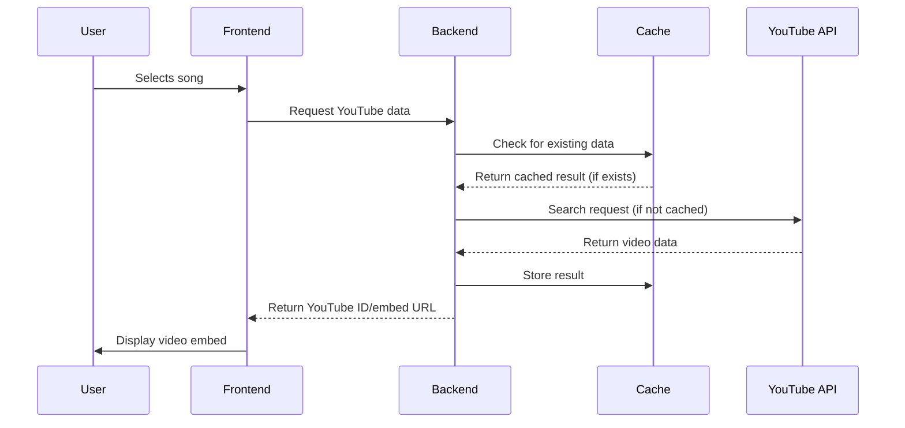

# YouTube API Implementation Documentation
## Heart Songs Music Game Application

### 1. Implementation Overview

Heart Songs integrates YouTube Data API v3 to provide music playback during multiplayer game sessions. The implementation consists of:

- **Backend Service** [`server/services/youtubeService.js`](https://github.com/rgarth/heart-songs/blob/main/server/services/youtubeService.js): Handles API communication
- **Cache Service** [`server/services/youtubeCacheService.js`](https://github.com/rgarth/heart-songs/blob/main/server/services/youtubeCacheService.js): Manages result storage
- **Frontend Integration** [`client/src/services/musicService.js`](https://github.com/rgarth/heart-songs/blob/main/client/src/services/musicService.js): Coordinates UI interactions
- **Homepage:** [https://heart-songs.vercel.app](https://heart-songs.vercel.app)
- **Source code:** [https://github.com/rgarth/heart-songs](https://github.com/rgarth/heart-songs)

### 2. API Access Configuration

```env
# Environment Variables
YOUTUBE_API_KEY=your_api_key_here
```

**API Endpoints Used:**
- `GET /youtube/v3/search` - Primary search functionality
- Parameters: `part=snippet`, `type=video`, `videoEmbeddable=true`, `videoCategoryId=10`

### 3. Integration Flow



### 4. Search Strategy Implementation

**Audio-First Approach:**
```javascript
// Search strategies by preference
if (preferVideo) {
  searchStrategies = [
    `${query} music video`,
    `${query} official video`,
    query
  ];
} else {
  searchStrategies = [
    `${query} official audio`,
    `${query} audio`,
    `${query} topic`,
    query
  ];
}
```

**Content Classification:**
- Detect video vs. audio content based on title indicators
- Calculate confidence scores for search accuracy
- Filter by channel type (Topic channels, VEVO, etc.)

### 5. Data Storage and Caching

**Cache Schema:**
```javascript
{
  trackKey: "artist:track",
  audio: {
    youtubeId: String,
    youtubeTitle: String,
    confidence: Number,
    firstSearched: Date,
    lastAccessed: Date
  },
  video: {
    youtubeId: String,
    // Similar fields for video versions
  },
  accessCount: Number,
  createdAt: Date
}
```

**Cache Management:**
- TTL: 90 days from last access
- Automatic cleanup of old entries
- In-memory recent lookups cache (30-second TTL)

### 6. Quota Management

**Current Status:**
- Daily Quota: 10000 units
- Search Cost: 100 units per request
- Effective Limit: 100 search per day

**Monitoring:**
```javascript
// Quota tracking
let quotaExhausted = false;
let quotaResetTime = null;

// Error handling
if (error.code === 403 && error.message.includes('quota')) {
  quotaExhausted = true;
  quotaResetTime = calculateNextReset();
}
```

### 7. User Interface Integration

**Frontend Components:**
- `SelectionScreen.js`: Song search interface
- `VotingScreen.js`: YouTube embeds display
- `FinalResultsScreen.js`: Playlist generation

**Embed Implementation:**
```javascript
// Generate YouTube embed URL
const getYouTubeEmbedUrl = (youtubeId) => {
  return `https://www.youtube.com/embed/${youtubeId}`;
};

// React component usage
<iframe 
  src={getYouTubeEmbedUrl(submission.youtubeId)}
  width="100%" 
  height="300"
  frameBorder="0" 
  allow="accelerometer; autoplay; clipboard-write; encrypted-media; gyroscope; picture-in-picture" 
  allowFullScreen
/>
```

### 8. Error Handling and Fallbacks

**Graceful Degradation:**
1. Cache miss → API search
2. API quota exceeded → Display placeholder with direct YouTube link
3. Video unavailable → Show error message with search option
4. Network error → Retry with exponential backoff

**User Experience Preservation:**
- Games continue without YouTube embeds if API unavailable
- Direct YouTube search links as backup
- Clear messaging about temporary limitations

### 9. Compliance Measures

**Terms of Service Adherence:**
- Only use embeddable videos
- Provide proper attribution to YouTube
- No content downloading or redistribution
- Users directed to YouTube for full functionality

**Privacy Considerations:**
- No user data sent to YouTube (anonymous searches)
- Minimal metadata storage
- Automatic data cleanup

### 10. Performance Metrics

**Current Performance:**
- Cache hit rate: ~70%
- Average search time: 200-500ms
- API call reduction: 70% through caching
- Typical game usage: 15-100 API calls

**Bottlenecks:**
- Daily quota limitation prevents concurrent games
- Single search failure blocks game progression
- Limited fallback options for popular songs

### 11. Deployment Configuration

**Production Environment:**
```yaml
# Environment Variables
YOUTUBE_API_KEY: encrypted
MONGODB_URI: connection_string
NODE_ENV: production
```

**Monitoring:**
- API usage tracking
- Error rate monitoring
- Cache performance metrics

### 12. Future Optimizations

**Proposed Enhancements:**
1. Implement search result preloading for popular songs
2. Add batch search capabilities
3. Optimize search queries based on cache analytics
4. Implement search result sharing between games

This implementation ensures efficient, compliant use of YouTube API Services while providing an engaging user experience in the Heart Songs application.
