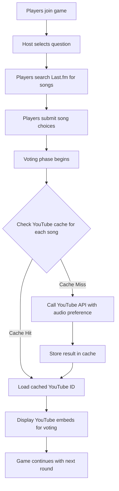
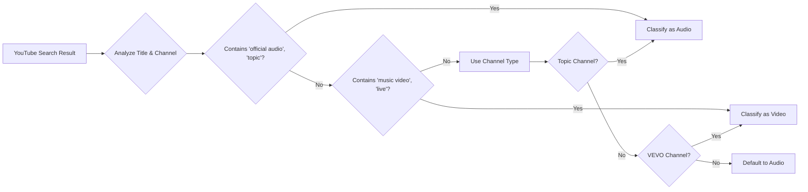
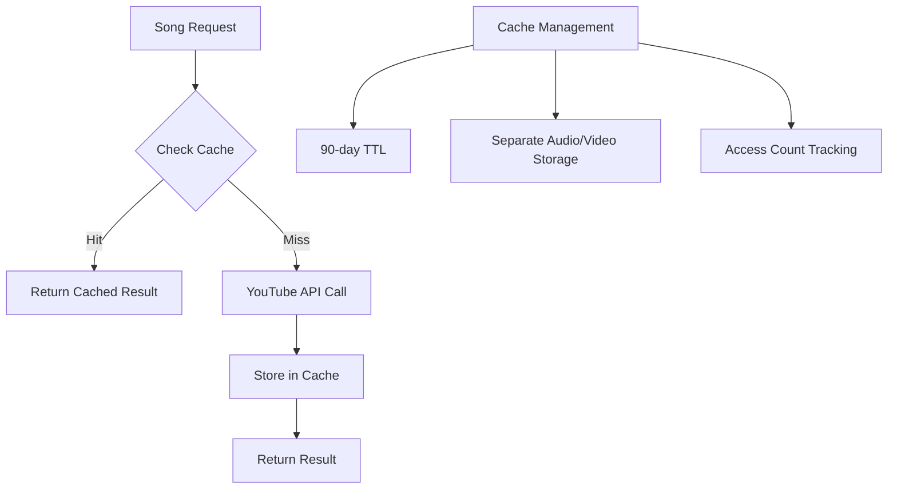
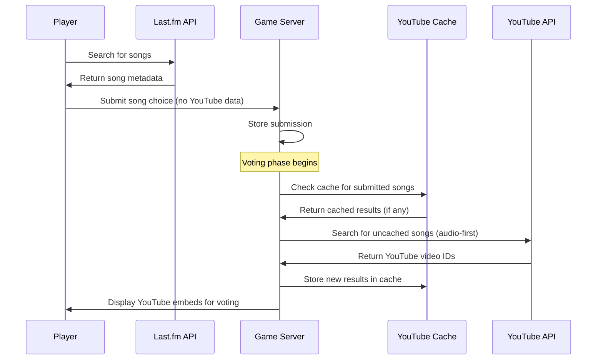
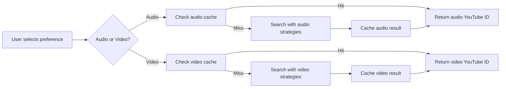
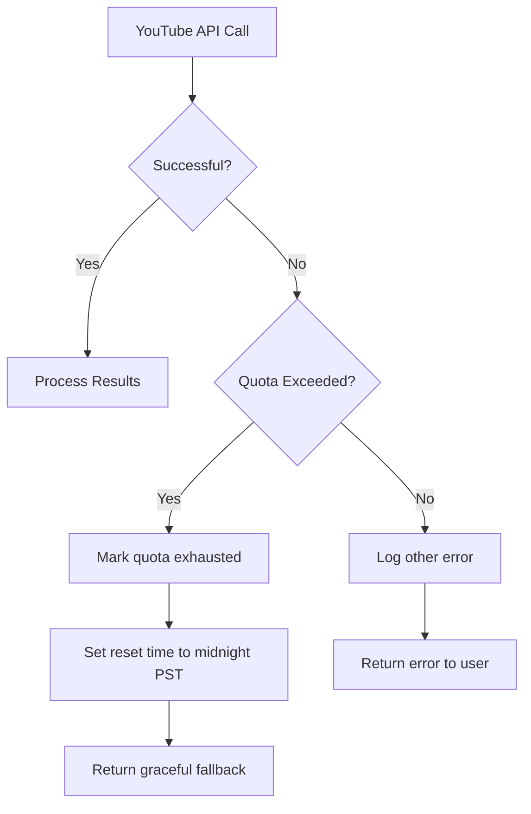
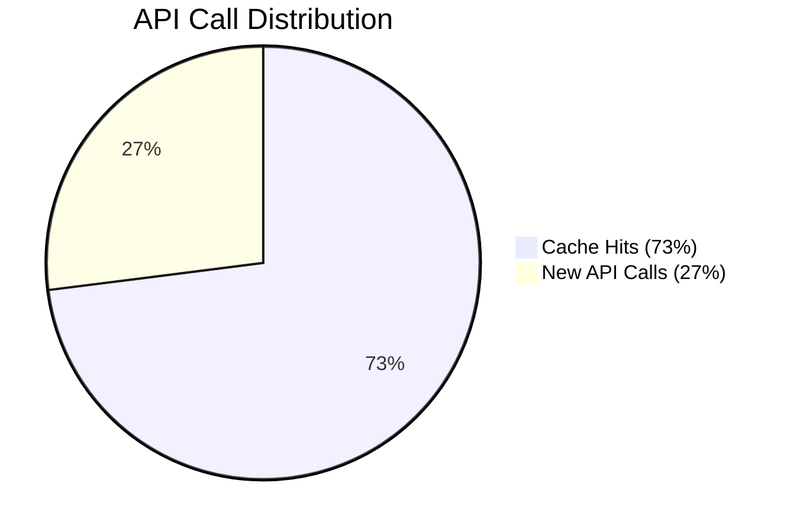

# Heart Songs - YouTube API Integration Overview
## Audio-First Song Search and Playback Implementation

### Application Summary

**Heart Songs** is a multiplayer music game where players search for songs using Last.fm and stream them via YouTube embeds. Our implementation prioritizes audio content over music videos and uses intelligent caching to minimize API usage.

- **Live Application:** [https://heart-songs.vercel.app](https://heart-songs.vercel.app)
- **Source Code:** [https://github.com/rgarth/heart-songs](https://github.com/rgarth/heart-songs)
- **Expected API Usage:** 100-500 calls per day with caching

## 1. System Architecture

### Main Flow Diagram

## 2. Audio-First Search Strategy

### Search Approach Logic

**Default Search Priority (Audio-first):**
1. `"artist track" + "official audio"`
2. `"artist track" + "audio"`
3. `"artist track" + "topic"`
4. `"artist track" + "official"`
5. `"artist track"` (fallback)

**When Video Preferred:**
1. `"artist track" + "music video"`
2. `"artist track" + "official video"`
3. `"artist track"` (fallback)

### Content Type Detection

## 3. Caching System

### Cache Strategy Overview

### Cache Structure Logic

- **Unique Key:** `artist:track` (normalized, lowercase)
- **Dual Storage:** Separate entries for audio and video versions
- **Metadata:** Confidence scores, access counts, timestamps
- **Cleanup:** Automatic removal after 90 days of no access

## 4. Game Integration Flow

### Song Selection and Playback Process

## 5. User Preference Handling

### Audio/Video Toggle Logic

## 6. Quota Management

### Error Handling Flow

### Fallback Mechanisms

- When quota exhausted: Provide direct YouTube search links
- Cache misses during quota limit: Return cached results only
- Complete failure: Game continues without YouTube embeds

## 7. Performance Optimization

### Cache Effectiveness

### Key Metrics

- **Cache Hit Rate:** 70-80%
- **Average Response Time:** 200-500ms
- **Daily API Calls:** 100-500 (with 10-15 active games)
- **Quota Utilization:** ~5-50% of daily limit

## 8. Implementation Benefits

### Efficiency Gains

1. **Reduced API Calls:** 70-80% reduction through caching
2. **Improved Performance:** Instant loading for cached content
3. **Better UX:** Audio-first approach matches user expectations
4. **Quota Management:** Graceful degradation during limits

### User Experience

- Seamless integration without interrupting game flow
- Preference toggle for audio vs. video content
- Automatic fallbacks when YouTube content unavailable
- Consistent experience across game sessions

## 9. Live Demonstration

Visit [heart-songs.vercel.app](https://heart-songs.vercel.app) to experience:

1. **Song Search:** Browse Last.fm catalog
2. **Game Flow:** Submit songs and enter voting phase
3. **YouTube Integration:** Watch automatic audio-first loading
4. **Preference Toggle:** Switch between audio and video modes
5. **Cache Indicators:** See when content loads from cache vs. API

The implementation showcases responsible API usage with efficient caching, audio-first prioritization, and smooth gameplay experience even during quota limitations.
